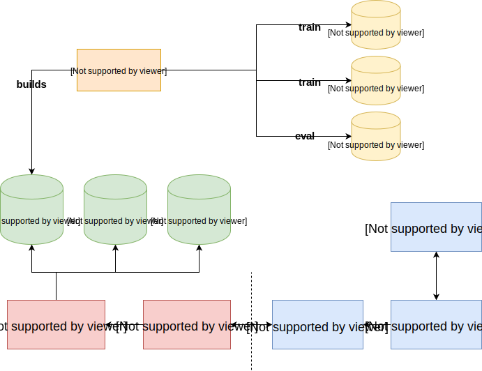

# Writing Style

This application is designed to help students improve their word choice in their writing, targeted at students who are deaf or hard of hearing  whose first language is not english. Students can enter a sample of their writing and will be given options to replace any informal or repeated words that were found.

This is a web application with a pug and javascript front end, python flask back end, and a MySQL database. The application is dockerized so it easy to deploy it anywhere for both development and production. 

## Running the Application
To get started and run the application execute the bash script ``runlocal.sh`` which will build and run the docker container. The application listens on port 80 so it will be accessible by going to ``localhost:80/prototype``.

## Architecture


**Blue** - front end which runs in the user's web browser

**Red** - back end which runs in AWS in the docker container

**Green** - databases, WordFormalities and Thesaurus are tables in a MySQL database in AWS. Informal words is a CSV file located on the webserver.

**Orange** - machine learning model trained to classify formal vs. informal sentences, used to determine formalities of individual words and build the WordFormalities table

**Yellow** - data sources for the machine learning model, not databases

### Key files
 - ``./templates/`` - pug template files which layout the HTML for the web pages in the application
 - ``./www/images/`` - images used in the front end webpages
 - ``./www/script/`` - front end javascript code
   - ``./www/script/main.js`` - controller on the front end, handles all of the UI logic
   - ``./www/script/writinganalyzer.js`` - model on the front-end, keeps track of writing sample state, makes API calls, generates HTML
   - ``./www/script/animate.js`` - library used for animations, such as the pulse of a word when selected from the right panel
- ``./www/style`` - CSS used to format the pages
- ``./app.py`` - routes all of the API calls
- ``./analyzer.py`` - main piece of the back end, analyzes the writing sample and makes necessary database calls
- ``./word_file.py`` - class to read the ``words.csv`` 
- ``./words.csv`` - list of 1000 informal words and their most common definitions which are represented as HEADWORDS. These are described in more detail in the database section.

## Database
The MySQL database hosted in AWS (ws-db.cxn6r23mlloe.us-east-1.rds.amazonaws.com) has the following tables

- ``lemmas`` - Contains mappings from a word to its root word. For example: 'running' to 'run'
  - ``word`` - The word to find the root of
  - ``lemma`` - The root of the word
  - ``pos`` - The part of speech
- ``thesaurus`` - Contains words and their root meaning (semantic root) which.
  - ``wordnumber`` - Unique id for the word
  - ``word`` - The word
  - ``headwordnumber`` - The unique identifier of the headword
  - ``headword`` - The definition category of the word. All words in the same definition category have the same headword
  - ``pos`` - The part of speech of the word
- ``words`` - Contains words and their formality scores
  - ``regWord`` - The word
  - ``formalityScore`` - The formality score of the word, closer to 1 is more formal closer to 0 is more informal. 
  - ``formality`` - Boolean formality score, is 1 if the formality score is >0.5
  - ``totalSentenceCount`` - The total number of sentences the word appeared in

## Formality Classifier
This is a machine learning model that was trained to classify formal vs. informal sentences. The training data consisted of comments on reddit posts (informal) and the brown corpus (formal). Once it was able to correctly identify the formality of sentences, it was used to find informal words. The formality score of each word in the database is calculated as:

```
formal_sentences / (informal_sentences + formal_sentences)
```

So if a word only appeared in formal sentences it would have a formality score of 1 and if it only appeared in informal sentences it would have a formality score of 0.

More information can be learned of this project by referring to its README. It is available here: https://github.com/Experiment5X/FormalityClassifier